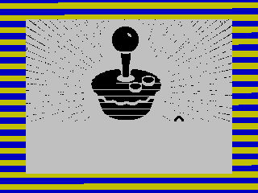
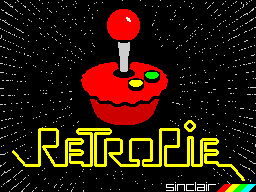

# ZXSpectrumSplash
ZX Spectrum splash video for RetroPie. I started with an HD resolution image of the RetroPie pie-stick and lettering. Using GIMP I scaled it down to Spectrum resolution, 256x192, and converted it to monochrome. Then the difficult part, manipulating the monochrome image so I could colorize it using the Spectrum's 15 color pallett and 8x8 attribute grid. Finally, I exportied the finished image to PNG and converted it to SCR/TAP using [PNG-to-SCR](https://github.com/MatejJan/PNG-to-SCR) and captured a video of it loading using [FUSE](https://en.wikipedia.org/wiki/Fuse_(emulator)).

The MP4 video was create by converting the FMF output from FUSE to AVI using FUSE utils, then converting the AVI to MP4 using ffmpeg.

## Loading bit-map data

## Loading attribute data

## The final product

